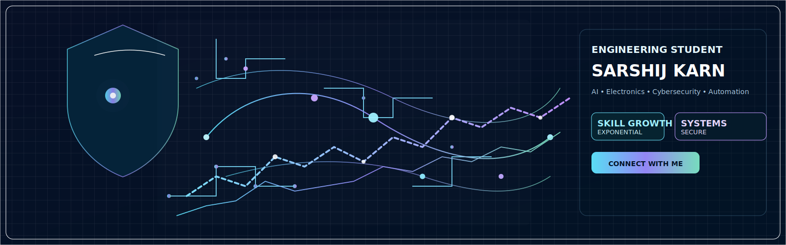

<h1 align="center">
  
</h1>

  

  

---

### 👨‍💻 About Me

I’m **Sarshij Karn**, currently pursuing a degree in **Electronics, Communication and Information Engineering**.  
I’m deeply passionate about **technology, AI, electronics, automation, and cybersecurity**.  
I love solving problems, building intelligent systems, and exploring the limits of tech.  

- 🔍 Highly curious about **AI, automation, embedded systems, and cybersecurity**  
- 🧠 Focused on **learning, experimenting, and creating smart solutions**  
- 💡 Skilled in leveraging **AI tools, programming, and electronics** for practical innovation  
- ⚡ Constantly improving **problem-solving, coding, and analytical skills**  

---

### 🛠️ Skills & Expertise

| Category | Skills |
|----------|-------|
| **Languages** | C, C++, Python |
| **Frameworks / Libraries** | TensorFlow, Keras, OpenCV, Mediapipe, Pandas, NumPy, Matplotlib, Scikit-learn |
| **Tools & Platforms** | Git, GitHub, VS Code, Linux, Arduino |
| **Interests** | AI Assistants, Automation, IoT, Cybersecurity, JARVIS-style assistants |

---

### 📊 GitHub & Tech Stats

  

---

### 📫 Connect With Me

  
  
  
  
  

---
